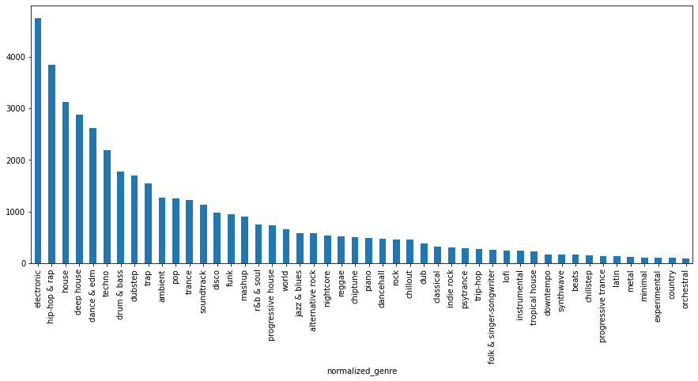

# scdata

`scdata` is a dataset of tracks downloaded from [SoundCloud](https://soundcloud.com). It only
includes tracks that are licensed under [Creative Commons](https://creativecommons.org/).

## Setup

```
python3 -m venv .venv
source .venv/bin/activate
pip install -e .
```

## Overview

The dataset was created in April 2021. It consists of 47858 tracks that were uploaded either under
a Creative Commens license, or with no rights reserved. For each MP3 track, the dataset has the full
metadata as it was returned by the SoundCloud API. Furthermore, every track in the dataset has a
cover image.

The dataset has been split into a train set (26841 tracks), a dev set (1515 tracks), and a test set
(1503 tracks).

Genres can be arbitrarily specified on SoundCloud. Here, we normalize genres according to a
hand-defined (and likely flawed in some sense) genre list. For more details, please refer to
[`genre.py`](src/scdata/genre.py). The dataset consists only of tracks whose normalized genre is part
of this list. The dataset metadata still contains the raw genre, so the genre normalization can be
redefined. The following figure shows the genre distribution of the training data. The genre
distribution is quite imbalanced as a large portion of the dataset's tracks are in an electronic
genre.



## Usage

Track metadata is stored in a single file called `scdata.json`. Example usage:

```python
import json

with open('scdata.json') as f:
   scdata_meta = json.load(f)

# TODO
```

## Data Preparation

The following steps describe how the dataset was prepared.

Note that this is a non-deterministic process, and it depends on the current state of SoundCloud.
Thus, if you re-run this process, you will not reproduce the exact same dataset.

### 1 Crawling

The crawler can be started like this
```
tools/crawl.py | tee -a crawl.log
```

The state is written to `crawler_state.json` every 500 steps, and the process can be resumed from
this.

The crawler requires a `.env` file to be available in the current directory, containing the keys
`SC_CLIENT_ID` and `SC_OAUTH_TOKEN`. The values for these can be inferred by visiting SoundCloud
and using the developer tools to inspect network calls made by your browser. This is necessary for
using the SoundCloud API.

#### Implementation Details

The crawler maintains the following state:
- Sets of visited tracks, playlists, and users.
- A dictionary of candidate playlists.
- A dictionary of all tracks that were found so far.

The crawler starts from a single candidate playlist and then iteratively performs the following
steps:

1. Determine a playlist to expand according to the playlist score (see below for more detail).
2. Download the metadata of the first 100 tracks in that playlist, and record them in the state.
3. For some of the new tracks, check which other playlists they are contained in, and add these
   as candidates.
4. Query for users that have liked the current playlists, and add other playlists liked by these
   users to our candidates. Also add tracks liked by these users to our state.

#### Playlist Score

The playlist score determines which playlists are more likely to get expanded by the crawler. It is
an essential part of the crawler.

The playlist score has two goals:
1. Favor playlists that contain songs with a free license.
2. Favor playlists that have genres which are underrepresented so far.

   The genre names are normalized towards a canonical representation, since otherwise the crawler
   would consistently prefer playlists with made up genre names.

Balancing the two goals seems to be difficult. If you want to improve the crawling process, the
playlist score is a good place to start. In initial experiments, without the playlist score, the
crawler ended up finding too few free tracks.

Note that the playlist score usually only has access to full information of the *first five* tracks
in the playlist. For the other tracks, we would need to make individual requests, which is something
we want to do only for the playlist that has been chosen for expansion. This makes the job of the
playlist score more difficult, since it has only limited genre and license information.

### Output

The crawler prints some statistics every 10 steps. See [`logs/crawl.log`](logs/crawl.log) for
example output.

### 2 Scraping

Once the crawler has finished, we should have a `crawler_state.json` with a dictionary of tracks. So
far, we only have the track metadata. Next, we download the actual tracks with this call:
```
tools/scrape.py --crawler_state crawler_state.json --out audio
```

Audio files will be written to the specified `out` directory. Most likely, the download will fail
for some of the tracks.

Only tracks that satisfy all of the following conditions are downloaded:
1. The license is either Creative Commons or `no-rights-reserved`.
2. The track has a genre name.
3. The track has artwork.
4. The track has a title.
5. The track has a download link.

Some metadata, as well as the artwork, is added to the downloaded `.mp3` files.

### 3 Hash

Some of the tracks are duplicates of each other. To enable detecting these in the next step, we
precompute the MD5 hash of each track:

```
find audio -name '*.mp3' | parallel -j 64 md5sum > audio/md5sums.txt
```

This is a very crude method for deduplication, since it will only find exact reuploads (with
identical MP3 metadata). However, it already finds quite a lot of duplicates.

#### Dedupe Cover Only

Alternatively, we can dedupe according to the cover only. This will detect more duplicates.

For this, first install the rust tool [`id3-image`](https://lib.rs/crates/id3-image). Then, run
```
find audio -name '*.mp3' | xargs -L 1 -P 32 id3-image-extract
```
to extract images from the songs. The `.jpg` files will be placed next to the `.mp3` files in the
`audio` subdirectories. Extraction may fail for tracks with invalid or missing cover images. This
is not a problem if it only happens for a few hundred tracks. Compare the counts like this:
```
$ find audio -name '*.jpg' | wc -l
48107
$ find audio -name '*.mp3' | wc -l
48231
```

Next, precompute the MD5 hash of each image:
```
find audio -name '*.mp3' | parallel -j 64 md5sum > audio/md5sums.covers.txt
```

### 4 Finalize Dataset Creation

Sample the train/dev/test split over deduplicated files, and write the metadata JSON file.

The metadata is just a dictionary mapping from the track ID to the raw track metadata as it was
returned by the SoundCloud API. We only add the key `scdata_split` field to each metadata, which
has as its value either "training", "validation", or "test".

```
tools/finalize.py \
    --audio_dir audio \
    --crawler_state crawler_state.json \
    --out_file scdata.json \
    --checksum_file audio/md5sums.txt \
    | tee logs/finalize.log
```

This command also removes songs that are too short (fewer than 10 seconds), or too long (more than
15 minutes). Surprisingly, quite a lot of the songs are longer than 15 minutes: more than 10k out
of 50k tracks. This could be because a disproportionate number of free tracks are mixes.
